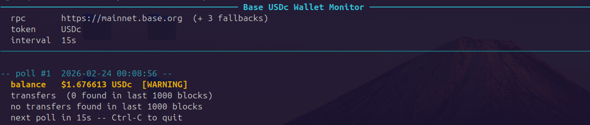

# Base USDc Wallet Monitor (Built for ClawRouter on OpenClaw)

Real-time CLI dashboard for your Base USDc balance. Polls the Base public RPC directly — no API key, no account, completely free.



## Quick Start

```bash
git clone https://github.com/fabgoodvibes/walletmonitor
cd walletmonitor
chmod +x run.sh
./run.sh --wallet 0xYourWalletAddress
```

The first run automatically creates a virtual environment and installs dependencies. Every subsequent run launches instantly.


Add your wallet PUBLIC key as an env var and an alias in your '~/.bash_aliases' for easy recalling

```bash

echo "export x402_PUB_KEY=your_wallet_PUBLIC_key_here" >> ~/.bashrc
echo "alias wm='~/code/walletmonitor/run.sh --wallet ${x402_PUB_KEY} -c'" >> ~/.bash_aliases
source ~/.bashrc
source ~/.bash_aliases
```

## Options

```
--wallet        Base wallet address, 0x...  (required)
--interval      Poll interval in seconds    (default: 15, min: 5)
-c              Enable colors               (default: plain black & white)
--hide-wallet   Hide your wallet address from all output
--debug         Show every poll event, even when nothing changes
```

## Examples

```bash
# Plain black & white, quiet output (default)
./run.sh --wallet 0xYourAddress

# Colored output with cyan headers and yellow/red balance alerts
./run.sh --wallet 0xYourAddress -c

# Hide wallet address from output (useful for screen sharing)
./run.sh --wallet 0xYourAddress --hide-wallet

# Show all poll activity for troubleshooting
./run.sh --wallet 0xYourAddress --debug

# All options combined
./run.sh --wallet 0xYourAddress -c --hide-wallet --interval 30
```

## Output

By default the monitor is quiet — it prints the balance once on startup, then only outputs a new line when something changes:

```
2026-02-24 00:08:56  starting up, fetching initial balance...
2026-02-24 00:08:56  $1.676613 USDc  [WARNING]

2026-02-24 00:42:11  balance changed  -0.250000 USDc
2026-02-24 00:42:11  $1.426613 USDc  [WARNING]

2026-02-24 00:42:11  new transfer detected:
  Block       Tx Hash        From           ...
```

With `--debug` every poll is printed, including "unchanged" and "sleeping" messages.

## Balance Alerts

The balance line includes a status indicator based on the current amount:

| Indicator    | Meaning                                  |
|--------------|------------------------------------------|
| *(none)*     | Balance is healthy (above $5.00 USDc)    |
| `[WARNING]`  | Balance is low — below $5.00 USDc        |
| `[CRITICAL]` | Balance is very low — below $1.00 USDc   |

With `-c` enabled, `[WARNING]` is shown in yellow and `[CRITICAL]` in red. These thresholds reflect the balance available for OpenClaw microtransactions — if it drops too low, LLM calls may start failing.

## Requirements

- Python 3.6+
- Internet access to Base public RPC (`mainnet.base.org` + 3 fallbacks)
- No API key required

## Tested On

- Linux Ubuntu 24.04

## How It Works

Communicates directly with the Base blockchain via JSON-RPC:

- **Balance** — calls `balanceOf()` on the USDc contract via `eth_call`
- **Transfers** — fetches ERC-20 `Transfer` events via `eth_getLogs` for the last 1,000 blocks

If the primary RPC endpoint is unavailable, it automatically falls back through a list of alternative public nodes.

---

## License

Copyright 2026 Fabio Pedrazzoli Grazioli

Licensed under the MIT License

https://opensource.org/license/mit

Permission is hereby granted, free of charge, to any person obtaining a copy of this software and associated documentation files (the “Software”), to deal in the Software without restriction, including without limitation the rights to use, copy, modify, merge, publish, distribute, sublicense, and/or sell copies of the Software, and to permit persons to whom the Software is furnished to do so, subject to the following conditions:

The above copyright notice and this permission notice shall be included in all copies or substantial portions of the Software.

THE SOFTWARE IS PROVIDED “AS IS”, WITHOUT WARRANTY OF ANY KIND, EXPRESS OR IMPLIED, INCLUDING BUT NOT LIMITED TO THE WARRANTIES OF MERCHANTABILITY, FITNESS FOR A PARTICULAR PURPOSE AND NONINFRINGEMENT. IN NO EVENT SHALL THE AUTHORS OR COPYRIGHT HOLDERS BE LIABLE FOR ANY CLAIM, DAMAGES OR OTHER LIABILITY, WHETHER IN AN ACTION OF CONTRACT, TORT OR OTHERWISE, ARISING FROM, OUT OF OR IN CONNECTION WITH THE SOFTWARE OR THE USE OR OTHER DEALINGS IN THE SOFTWARE.


